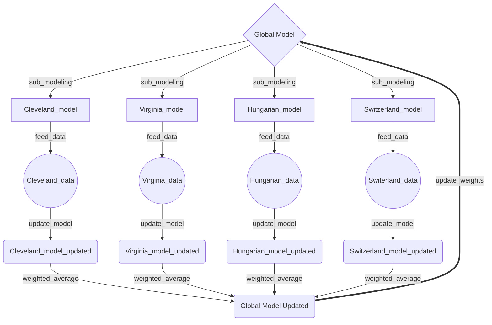

# Early Stage Heart Diease Detection with Federated Learning


## Description

Welcome! 😀

We are dedicated data scientists working with [Pakula BioMedical Fellowship Program](https://www.beloit.edu/academics/biology/resources-opportunities/summer-research/) for summer research! 

It has a focus on implementing Federated Learning on [UCI Heart Disease dataset](https://archive.ics.uci.edu/dataset/45/heart+disease) to help early stage detection of cardiovasular diseases.

---


## Stage I: Baseline Modeling

To create a baseline understanding of the project as well as testing our data cleaning accuracy, we delpoyed a set of traditional machine learning technique, the results for Cleveland datasets are shown as following.

| ML Technique  | Our Accuracy  | Other Research's Accuracy  |
| ------------- | ------------- | ------------------------ |
| Decision Tree  | 75.82%  | 83.57%  [Shrinivas D Desai et al.](https://link.springer.com/chapter/10.1007/978-981-13-0680-8_13)  |
| Random Forest  | 84.37%  |  86.90% [Pal and Parija](https://link.springer.com/chapter/10.1007/978-981-99-0412-9_11)  |
| SVM | 86.89%  |   77.70%    [Anitha S., Sridevi N.](https://hal.science/hal-02196156/)  |
| Bayesian Classifier  | 82.26%  |   86.60%      [Anitha S., Sridevi N.](https://hal.science/hal-02196156/)  |


Besides machine learning techniques, we also deployed clustering and deep learning methods for cross reference.
| ML Technique  | Our Accuracy  |
| ------------- | ------------- |
| SOM  | 81.19%  |
| Kmean  | 80.52%  |
|CNN | 79.85%|
|RNN|82.04%|


## Stage II: Federated Learning
### Getting started with FL
* Download the [MNIST data set from Kaggle](https://www.kaggle.com/datasets/scolianni/mnistasjpg)
* Run the Python files
  ```sh
   python FL_demo/run_federated_learning.py
   ```
* Global Model Accuracy: ```80.20%```
* Check out [Flower](https://github.com/adap/flower) with more detailed explanation about FL.

### Our FL pipeline:

### Results:
* ```Learning rate```: 0.01
* ```Optimizer```: SGD
* ```Loss function```: Sparse Cross Entropy
* Result after 100 ```global epochs```:

  | Model  | Accuracy  | Precision | Recall |
  |--------|------------|-------|----------|
  |MLP|85%|85%|85%|
  |CNN|temp|temp|temp|temp|
  |RNN|temp|temp|temp|temp|


## Roadmap
- [x] Implement Baseline experiment
- [ ] Federated Learning
  - [x] MLP
  - [ ] CNN
  - [ ] RNN
- [ ] Tranfer Learning


## Contact
Ethan Wang - [e13wang@gmail.com](e13wang@gmail.com) - [Linkedin Profile](https://www.linkedin.com/in/ethan-wang-938588175/)

Takeshi Matsuda - 

Project Link: [https://github.com/EthanWTL/HeartDiseasePakula](https://github.com/EthanWTL/HeartDiseasePakula)


## Acknowledgments:
* [Back-Propagation Neural Network Versus Logistic Regression in Heart Disease Classification](https://link.springer.com/chapter/10.1007/978-981-13-0680-8_13)
* [Heart Disease Risk Prediction Using Supervised Machine Learning Algorithms](https://link.springer.com/chapter/10.1007/978-981-99-0412-9_11)
* [HEART DISEASE PREDICTION USING DATA MINING TECHNIQUES](https://hal.science/hal-02196156/)
* [A Submodularity-based Agglomerative Clustering Algorithm for the Privacy Funnel](https://www.semanticscholar.org/paper/A-Submodularity-based-Agglomerative-Clustering-for-Ding-Sadeghi/4e7b3b31659c945ed0c953da9fe7af297b3f3675)
* [Early detection of silent ischaemic heart disease by 24-hour electrocardiographic monitoring of active subjects.](https://www.ncbi.nlm.nih.gov/pmc/articles/PMC458846/)
* [Development of a federated learning approach to predict acute kidney injury in adult hospitalized patients with COVID-19 in New York City](https://www.ncbi.nlm.nih.gov/pmc/articles/PMC8328073/)
* [Federated learning for multi-center imaging diagnostics: a simulation study in cardiovascular disease](https://www.nature.com/articles/s41598-022-07186-4)
